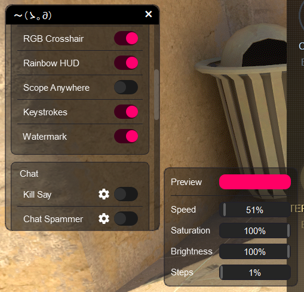
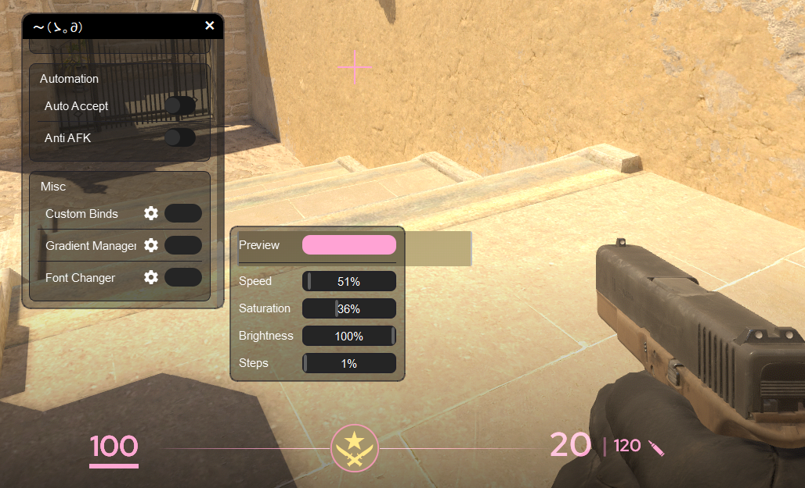
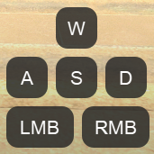
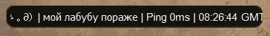
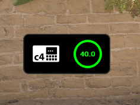

# PyScripts 🔮  

### Enhance Your *Counter-Strike 2* Experience

**PyScripts** is a lightweight, open-source toolkit for *Counter-Strike 2 (CS2)* that lets you personalize and streamline your gameplay. It works externally—never modifying game memory or files—using only what CS2 provides through console commands, Game State Integration (GSI), and log files.

---

## ⚠️ Disclaimer

**PyScripts** is a personal project by an independent developer, not affiliated with or endorsed by Valve Corporation, the creators of CS2. It offers features like *Auto Accept*, *Jump Throw*, and *Bomb Timer* to enhance convenience and fun. However:

- **Valve’s Rules**: Some features automate actions via external inputs or scripts. Valve discourages automation in competitive play, and while *PyScripts* avoids game memory manipulation (no VAC violations), **use in official matchmaking may still risk account bans** at Valve’s discretion.
- **User Responsibility**: You are solely responsible for complying with [Valve’s Terms of Service](https://store.steampowered.com/subscriber_agreement/) and [CS2 Rules](https://www.counter-strike.net/). The developer is not liable for bans, data issues, or loss of functionality.
- **Intended Use**: This tool is for personal enjoyment, experimentation, and learning—not for gaining unfair advantages. Use it responsibly in appropriate settings (e.g., private servers or casual play) to respect the CS2 community.

---

## ✨ What is PyScripts?

**PyScripts** is a utility that adds convenience and flair to CS2 through an external overlay and automation features. It leverages:

- **External Overlay**: Tracks CS2’s window for visual enhancements.
- **Config & Binds**: Executes commands via CS2’s built-in exec system (e.g., bind "KEY" "exec pyscripts1").
- **Game State Integration (GSI)**: Reads live game data like weapon status or bomb timers.
- **Console Logs**: Parses console.log for events like match acceptance.

No game files are altered beyond user-created configs, and no hacks are involved—just clean, creative tools for CS2 enthusiasts.

---

## 🚀 Features

Here’s what *PyScripts* offers:

| Feature              | Description                                                        |
|----------------------|--------------------------------------------------------------------|
| **Chat Spammer**      | Spams a selected message in chat using a bind (F22).               |
| **Kill Say**          | Automatically sends a message in chat after a kill.                |
| **Kill Sound**        | Plays a sound when you kill an enemy.                              |
| **Bomb Timer**        | Displays a bomb timer overlay in-game.                             |
| **Scope Anywhere**            | Draws a sniper scope overlay on the screen.                        |
| **Sniper Crosshair**        | Custom crosshair overlay for the game.                             |
| **RGB Crosshair**     | Animated RGB (rainbow) crosshair overlay.                          |
| **Rainbow HUD**       | Adds a rainbow effect to HUD elements.                             |
| **Keystrokes**       | Shows WASD/LMB/RMB key presses on the screen.                      |
| **Knife Switch**      | Automatically switches to knife and back for quick actions.         |
| **XCarry**           | Automatically drops primary weapon in slots to move them on the map.  |
| **Angle Bind**        | Allows quick view angle changes using a bind.                      |
| **Custom Binds**      | Lets you create and use custom binds for various actions.           |
| **Auto Accept**       | Automatically accepts matchmaking.                                 |
| **Anti AFK**          | Prevents AFK kick by simulating activity.                          |
| **Recoil Crosshair**  | Shows crosshair movement with recoil compensation.                 |
| **Watermark**        | Adds a PyScripts watermark overlay in-game.                        |
| **Font Changer**      | Allows you to change the in-game font for a custom look.           |

---

## 🛠️ Installation

Get started easily:
1. Download Python: Visit the official Python downloads page at python.org and download the latest stable version (e.g., Python 3.13.5 as of June 11, 2025) for your platform. During installation, make sure to check “Add Python to PATH”
2. **Download**: Grab the latest release from [GitHub Releases](https://github.com/yourusername/PyScripts/releases).
3. **Set Launch Options**: In Steam, add -conclearlog -condebug +exec pyscripts0 to CS2’s launch options.
4. **First Run**: Launch install_requirements.bat to install Python Libraries then PyScripts.py *before* CS2 (afterward, it’s fine to start with CS2 running).
5. **Play**: Open CS2, configure settings in the PyScripts menu (*press Insert to show/hide the menu*), and enjoy!
6. **Exit**: Close via the bind button in the menu or the exit button.

You can change the key bindings for opening the menu and exiting the program in **Menu → Custom Binds**.

---

## ⚙️ Configuration

Tailor *PyScripts* to your liking:

- **Auto Accept**: Set delay before searching for the "Accept" button.
- **Bomb Timer**: Adjust timer size, gradient, and transparency.
- **Sniper Crosshair**: Syncs with your in-game crosshair settings.
- **Keystrokes**: Customize scale, gradient, animation speed, colors, and transparency.
- **Kill Sound, Round Start Alert**: Adjust volume and select custom sound files.
- **Auto Stop**: Toggle auto-stop on/off or activate only while held.
- **Chat Spammer**: Set chat message and hotkey for toggling.
- **Angle Bind**: Bind to offset the player yaw (horizontal view) angle and set degree.
- **Watermark**: Toggle gradient, set transparency, and ping update rate.
- **Gradient Manager (RGB Effects)**: Adjust steps, delay, color range, saturation, and brightness.

Other features (e.g., Knife Switch, Jump Throw, FPS Limiter) are easy to configure—no details needed here!

---

## 🧠 How It Works

*PyScripts* enhances CS2 safely and externally by:

- **Command Sending**: Features like *Jump Throw*, *Drop Bomb*, and *Auto Pistol* work by writing CS2 commands to numbered config files (e.g., pyscripts1.cfg). These are triggered via pre-bound keys (e.g., F13 to F24) simulated by *PyScripts*. In CS2, you bind a key to exec pyscripts1 (set via launch options), and *PyScripts* presses that key to run the command.
- **Auto Accept**: Monitors console.log for match detection, then simulates a mouse click on the "Accept" button.
- **Sniper Crosshair**: Reads active weapon data from GSI and overlays a custom crosshair synced with your settings.
- **Bomb Timer**: Tracks bomb state via GSI, updating the display with defuse urgency cues.
- **RGB Crosshair**: Cycles colors by sending console commands to adjust crosshair settings.
- **Knife Switch**: Uses switchhands via config files triggered by keybinds.

This method relies entirely on CS2’s native systems—no memory reading, writing, or injection—keeping it aligned with standard scripting practices while avoiding game file tampering.

---

## 🖼️ Screenshots & Fully synchronized RGB

### Menu  
|  |  |  
|-----------------------------|-----------------------------|  

### Keystrokes, Watermark, Bomb Timer  
|  |     |  
|---------------------------------------|-------------------------------------------------------------------------------|  

---

## 🛡️ Built With

Powered by these amazing tools:
- **PyQt / PySide**: Overlay and UI framework.
- **Python**: Core logic and scripting.
- **Windows API**: Window tracking and input simulation.
- **Python libraries**: File management, threading, etc.

---

## 💖 Support the Project

Love PyScripts? Support development with a skin donation!

- **[Skin Trade Link](https://steamcommunity.com/tradeoffer/new/?partner=1570577878&token=1WuPKdBZ)**

https://steamcommunity.com/tradeoffer/new/?partner=1570577878&token=1WuPKdBZ

---

## 📜 License

Released under the [MIT License](LICENSE.txt). Feel free to use, modify, and share—just keep the original license and credit the author.

---

## 🌟 Get Involved

Spotted a bug? Have a feature idea?
- File an [Issue](https://github.com/yourusername/PyScripts/issues) or submit a [Pull Request](https://github.com/yourusername/PyScripts/pulls).
- Join the community and let’s elevate CS2 together!

---

Created with ❤️ by [bogdasha666](https://github.com/bogdasha666)
